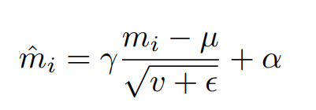

The idea:
 Force the image X to have the similiar feature to conditional image Y by normalize feature of image input X to have similiar distribution to image Y

Current works used Feature normalization to normalize the feature distribution of a layer close to the distribution of 'Discriminative feature' extracted from pre-trained metric model.
- **Formulation**

  


## Model options:
1. **sampling from real images**
```
require:
    x: image
    n = 2 # (n shot)
    G = Generator
    D = Discriminator
    F = pre-trained VGG16 on i

# training G and D
While model not converge do:
    # train G #
    draw x from dataset
    f = F(x)
    z ~ p(0, 1)
    x' = G(f, z) # concatenate f and z
    loss_G = loss_adv + λ*l2(f - F(x')) + γ*l2(x - x')
    update weights for G with loss_G

    # train D #
    x = real_images
    x' = fake_images
    loss_D = hinge(x, x')
    update weights for D with loss_D
```

2. **sampling from latent z**
```
require:
    x: image
    n = 2 # (n shot)
    G = Generator
    D = Discriminator
    F = pre-trained VGG16 on i

# compute multivariate distribution #
z ~ p(class_id)

# training G and D
While model not converge do:
    # train G #
    draw x from dataset
    z ~ p(class_id)
    f = F(x)
    x' = G(f, z) # concatenate f and z
    loss_G = loss_adv + λ*l2(f - F(x')) + γ*l2(x - x')
    update weights for G with loss_G

    # train D #
    x = real_images
    x' = fake_images
    loss_D = hinge(x, x')
    update weights for D with loss_D
```